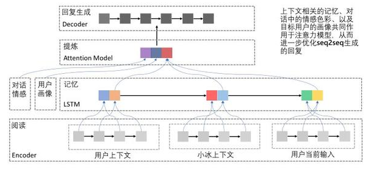

NLP 发展趋势
===

Index
---
<!-- TOC -->

- [【2018.11】预见未来｜NLP将迎来黄金十年（MSRA）](#201811预见未来｜nlp将迎来黄金十年msra)
    - [NLP 新的发展基础](#nlp-新的发展基础)
    - [NLP 的研究热点](#nlp-的研究热点)
    - [NLP 技术的重要进展](#nlp-技术的重要进展)
    - [值得关注的 NLP 技术](#值得关注的-nlp-技术)
- [【2019.02】对话 MSRA 副院长周明：回望过去，展望未来，NLP有哪些发展趋势？](#201902对话-msra-副院长周明回望过去展望未来nlp有哪些发展趋势)
    - [MSRA 的重点](#msra-的重点)
    - [NLP 领域进展](#nlp-领域进展)
    - [中文 NLP 的突破](#中文-nlp-的突破)
    - [2019 研究热点](#2019-研究热点)

<!-- /TOC -->

## 【2018.11】预见未来｜NLP将迎来黄金十年（MSRA）
> https://www.toutiao.com/a6628158223692071427 - 今日头条

### NLP 新的发展基础
- 来自各个行业的文本大数据将会更好地采集、加工、入库；
- 来自搜索引擎、客服、商业智能、语音助手、翻译、教育、法律、金融等领域对NLP的需求会大幅度上升，对NLP质量也提出更高的要求；
- 文本数据和语音、图像数据的多模态融合成为未来机器人的刚需。

### NLP 的研究热点
1. 将知识和常识引入目前基于数据的学习系统中；
1. 低资源的NLP任务的学习方法；
1. 上下文建模、多轮语义理解；
1. 基于语义分析、知识和常识的可解释 NLP。

### NLP 技术的重要进展
- 神经机器翻译
    - （Hassan et al., 2018）高效利用大规模单语数据的联合训练、对偶学习技术；解决曝光偏差问题的一致性正则化技术、推敲网络
- 智能人机交互
    - 聊天系统架构

        

    - 三层引擎：
        - 第一层，通用聊天机器人；
        - 第二层，搜索和问答（Infobot）；
        - 第三层，面向特定任务对话系统（Bot）
- 机器阅读理解
    - NL-Net
    - BERT
- 机器创作
    - 对联、
    - **歌词**的机器创作过程：
        - 确定主题，比如希望创作一首与“秋”、“岁月”、“沧桑”、“感叹”相关的歌；
        - 利用词向量表示技术找到相关的词，有“秋风”、“流年”、“岁月”、“变迁”等；
        - 通过序列到序列的神经网络，用歌词的上一句去生成下一句；如果是第一句，则用一个特殊的序列作为输入去生成第一句歌词
    - **谱曲**：类似一个翻译过程，但更为严格

### 值得关注的 NLP 技术
- 预训练神经网络
    - ElMo、BERT 等模型
    - 在什么粒度（word，sub-word，character）上进行预训练，用什么结构的语言模型（LSTM，Transformer等）训练，在什么样的数据上（不同体裁的文本）进行训练，以及如何将预训练的模型应用到具体任务，都是需要继续研究的问题。
- 低资源 NLP 任务
    - 无监督、半监督学习
    - 迁移学习、多任务学习
- 迁移学习
    - 不同的 NLP 任务虽然采用各自不同类型的数据进行模型训练，但在编码器（Encoder）端往往是同构的，即都会将输入的词或句子转化为对应的向量表示，然后再使用各自的解码器完成后续翻译、改写和答案生成等任务。
    - 因此，可以将通过不同任务训练得到的编码器看作是不同任务对应的一种向量表示模型；然后通过迁移学习（Transfer Learning）的方式将这类信息迁移到目前关注的目标任务上来
- 多任务学习
    - 多任务学习（Multi-task Learning）可通过端到端的方式，直接在主任务中引入其他辅助任务的监督信息，用于保证模型能够学到不同任务间共享的知识和信息；
    - McCann 等提出了利用**问答框架**使用多任务学习训练十项自然语言任务
        > [一个模型搞定十大自然语言任务](https://www.toutiao.com/a6569393480089469454)
- 知识和常识的引入
    - 应用：机器阅读理解、语义分析
    - 领域知识：维基百科、知识图谱
    - 常识的引入（缺乏深入研究）
- 多模态学习
    - 视觉问答
        - 基于问题生成的视觉问答方法（Li et al., 2018）
        - 基于场景图生成的视觉问答方法（Lu et al., 2018）
    - 视频问答

## 【2019.02】对话 MSRA 副院长周明：回望过去，展望未来，NLP有哪些发展趋势？
> https://www.toutiao.com/i6656937082805551624 - 头条

### MSRA 的重点
- 机器阅读理解（MRC）
- 神经机器翻译（NMT）
    - 联合训练、对偶学习
    - 一致性规范、推敲网络
- 语法检查（Grammar Check）
    - 自动生成训练语料、多次解码逐轮求优
- 文本语音转换（Text To Speech, TTS）
- 机器创作（写诗、谱曲、新闻）

### NLP 领域进展
- 新的神经 NLP 模型
- 以 BERT 为首的**预训练模型**
    - 大规模语料所蕴含的普遍语言知识与具体应用场景相结合的潜力
- **低资源** NLP 任务

### 中文 NLP 的突破
- 中文阅读理解
- 以中文为中心的机器翻译
- 聊天系统
    - 多模态聊天（小冰）
- 语音对话
    - 搜索引擎、语音助手、智能音箱、物联网、电子商务、智能家居等

### 2019 研究热点
> [NLP将迎来黄金十年](#2019预见未来｜nlp将迎来黄金十年)一文中有更详细的介绍，包括最新的论文推荐
1. 预训练模型
    - 上下文建模
1. 基于语义分析、知识和常识的可解释 NLP
    - 将知识和常识引入到目前基于数据的学习模型中
1. 多模态融合
    - 文本数据和语音、图像数据的多模态融合是未来机器人的刚需
1. 低资源 NLP 任务（无语料或者小语料的场景）
    - 半监督、无监督学习方法
    - Transfer Learning、Multi-task Learning
    - 语言学在 NLP 研究中的作用
        > 语言学家在自然语言处理研究中大有可为 - 冯志伟
1. 多模态融合
    - 在神经网络的框架下，可以用统一的模式来对多模态（语言、文字、图像、视频）进行建模（编码和解码），从而实现端到端的学习
    - 应用：Capturing、CQA/VQA、机器创作

