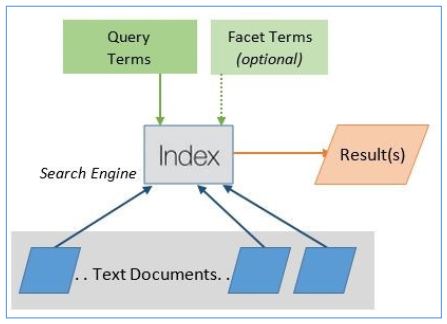
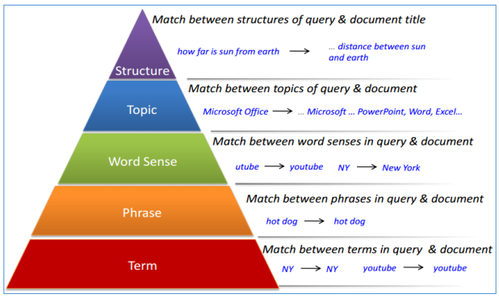
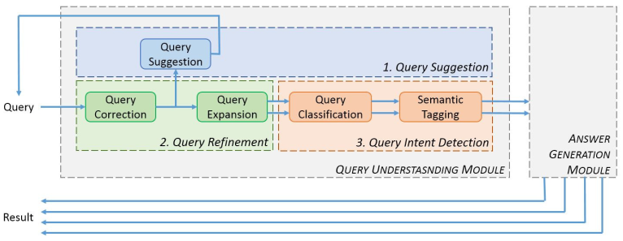
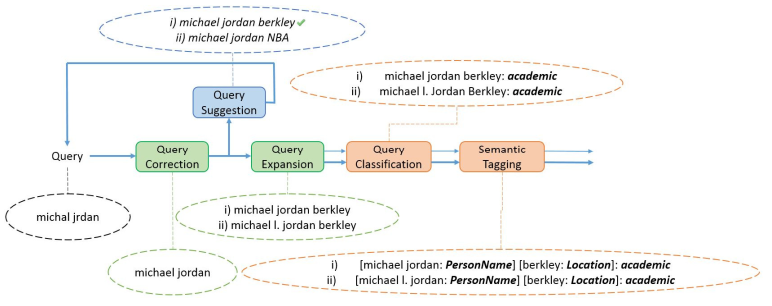
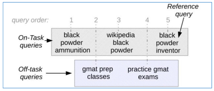

DQU 综述
===

Index
---
<!-- TOC -->

- [Introduction](#introduction)
    - [不同时期的搜索](#不同时期的搜索)
    - [查询理解系统的特点](#查询理解系统的特点)
- [深度查询理解](#深度查询理解)
    - [查询理解模块的作用与处理流程](#查询理解模块的作用与处理流程)
- [各组件的基本方法（2015）](#各组件的基本方法2015)
- [引用文献](#引用文献)

<!-- /TOC -->

<h3> 参考文献 </h3>

- (Prakash and Patel, 2015) Techniques for Deep Query Understanding

## Introduction

- 在过去的 20 年中，搜索查询的解释、处理以及向用户展示结果的方式一直在发生改变；
    - 从单纯基于文本匹配的检索到对查询的语义理解，包括上下文、位置、时间、用户之前的查询；

- 查询方式的改变：关键词查询（电脑，键盘输入） -> 自然语言查询（手持设备，语音输入）

**查询理解的应用**

- 上下文查询
    - 比如“Where can I eat cheese cake right now”，此时搜索引擎需要理解用户的意图、了解用户的位置以及当前的时间才能返回正确的结果

- 交互式问答查询
    - 返回准确的答案，比如“who is the president of USA now”
    - 当前查询可能与会话中的前一个问题有关

        

        > 要实现上述示例，需要将第一个问题改为“who is the president of USA 2010”；因为目前（2019年）美国总统 Trump 有过三位妻子，所以第四个问题将无法返回正确结果；同理，如果搜索“who is the president of USA 2009”，那么到第二个问题就会出错，因为 2009 年美国总统换届，那年有两位总统。

    - 此时，查询理解模块必须考虑上下文，并从答案生成模块中获取上一个问题的目标实体，以理解查询。

- AI 个人助理
    - 微软 Cortana、苹果 Siri、Google Now
    - 他们必须了解哪些查询需要重定向到 Web 搜索引擎，哪些查询用于本地设备操作。

### 不同时期的搜索

- 文本匹配
    - 使用  Lucene indexing 等方法构建从关键词到文档的反向索引；
    - 通过人工添加的标签过滤返回的结果；
    - 大多数购物网站依然在使用；

        

        
- Rank 排序
    - 底层依然是基本的文本匹配，但是加入了根据相关性排序的概念（Rank）
    - 相关性的计算基于一系列指标，如 TF-IDF、关键词相关性（keyword relevance）、网站权重（website authority）、流行度（popularity）、链接强度（link strength）等；

- 基于 NLP 技术的查询理解
    - 通过一个查询理解模块，利用 NLP 技术，通过上下文信息了解用户以前的搜索和浏览活动，以及用户的兴趣、位置、查询时间、位置天气等，以准确预测用户的意图并获得最佳结果。

### 查询理解系统的特点

1. 理解查询的语义

    语义理解的层次

    

1. 理解上下文和历史任务

    示例：搜索 “michael jordan” 可能会返回篮球运动员或者伯克利大学的机器学习教授，如果用户之前搜索了机器学习相关的关键字，那么用户的意图很可能是后者；

1. 个性化

    不同的用户有不同的兴趣，用户很可能会在他的兴趣领域或工作领域进行搜索。

## 深度查询理解

### 查询理解模块的作用与处理流程

**作用**：
1. 推断查询的意图；
1. 通过建议，引导用户到达一个明确的意图；
1. 改进查询结果。

**处理流程**：（标号不代表处理顺序）

- 首先由**查询细化子模块**中的**纠错组件**对原始查询进行处理，通常包括拼写更正、缩略语扩展、分词、合并、短语切分等；
- 修正后的查询被传递给**查询建议子模块**，该子模块用于发现那些可能导致更好结果的查询（下拉列表），并作为新的查询重新输入；
- 新的查询通过**查询拓展**组件找到同义查询，以避免术语不匹配带来的损失（因为搜索引擎的底层依然基于传统的文本匹配）；以上过程可能会进行多轮；
- 将扩展后的查询集合传入**查询意图检测子模块**，用于推断查询的确切意图，其中
    - **查询分类**组件用于标记查询所属的类别（用于过滤不相关的查询），通常被定义为运动、天气、旅游或视频等不同类别之一，如 “brazil germany” 可能会被定义为运动（如果搜索了足球）或旅游（搜索了巴西到德国的航班）；
        - 一个查询可能会被划分为多个片段（Segment），特别是对于句子类型的搜索，不同的片段被分为不同的类别；
    - **语义标注**组件对每个查询做语义标记，以进行精确的意图检测。
- 最后将扩展的意图标记查询集合传递到答案生成模块

- **查询纠错**发现了原始查询的拼写错误，并进行了纠正；
- **查询建议**给出了两个不同领域的可能推荐，这里假设用户选择了 “Michael Jordan berkley” 作为他真正的目标；
- **查询拓展**找到更多的同义查询加入查询集；
- **查询分类**将得到的查询集分类为目标类别（这里是 "academic"）；
- **语义标注**对查询中的不同片段进行标记，以获得准确的查询意图。

## 各组件的基本方法（2015）

**查询纠错**（Query Correction）
- CRF-OR（改进的 CRF）
    - (Jiafeng et al., 2008) A Unified and Discriminative Model for Query Refinement

**查询建议**（Query Suggestion）
- 利用 Click-Through 和 Session 数据进行上下文感知以解决歧义
    - (Huanhuan et al., 2008) Context-Aware Query Suggestion by Mining Click-Through and Session Data

**查询扩展**（Query Expansion）
- 路径约束随机游走（path-constrained random walks）
    - (Gao et al., 2013) Query Expansion Using Path-Constrained Random Walks

**查询分类**（Query Classification）
- 决策树
    - (Cao et al., 2009) Context-Aware Query Classification

**语义标注**（Semantic Tagging）
- 分层语法特征（Hierarchical Syntactic Features）、语义依赖特征（Semantic Dependency Features）
    - (Liu et al., 2013) Query Understanding Enhanced by Hierarchical Parsing Structures

## 引用文献
- [2] Learning to Personalize Query Auto-Completion
    - 本文讨论了使用位置特征、年龄和性别等用户特征、区域特征、用户短历史特征和长历史特征进行查询自动完成的问题，并给出了使用该方法进行意图预测的思路。
- [6] Context-Aware Query Classification
    - 本文讨论了上下文的使用和概念序列(概念后缀树)的遍历。
- [8] Evaluating the Effectiveness of Search Task Trails
    - 本文讨论了交错查询的情况：30% 的会话包含多个任务，5% 的会话包含交叉任务。

        

- [9] Task-Aware Query Recommendation
    - 给出了一种新的方法，用于识别交错的任务，并根据所识别的交错任务推荐查询。